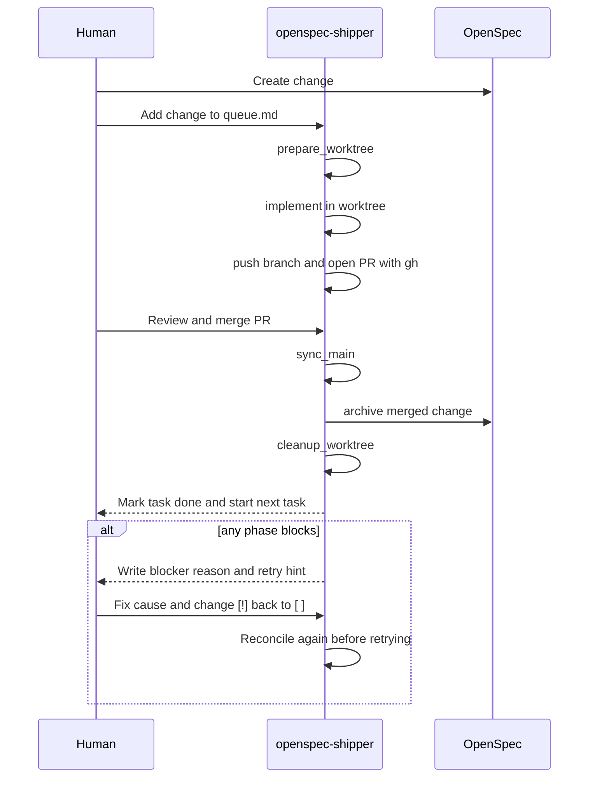

# openspec-shipper

`openspec-shipper` is a small CLI that runs an OpenSpec delivery queue through
AI executors. OpenCode is the stable v1 provider; Codex CLI and Claude Code are
experimental providers that share the same queue and delivery contract.

The package is npm-first and repo-local by default:

```bash
npm install -D openspec-shipper
npx openspec-shipper init
npx openspec-shipper doctor
```

Archive finalization currently commits and pushes directly to the configured
`baseBranch`. `doctor` queries GitHub before the queue starts and fails with a
clear explanation when that branch is protected. PR-based archive finalization
is not supported yet; this limitation is intentionally explicit while the
project gathers real-world workflow requirements.

There is no `postinstall` mutation. `init` is the command that installs project
assets, and it writes state only under `.openspec-shipper/` plus provider assets
such as `.opencode/`.

## Requirements

- `git`
- `gh`, authenticated with GitHub CLI
- OpenCode, Codex CLI, or Claude Code for the selected executor provider
- The package manager configured during `init`

`gh` is used by the runner to create pull requests after branch push and to
reconcile PR state before spending tokens. That is how `push` becomes
`waiting_for_merge`, and how `waiting_for_merge` becomes `sync_main` after a PR
has been merged.

Before running the queue, the configured base branch (`main` by default) should be clean except for ignored shipper
runtime state such as `.openspec-shipper/queue.md`, logs, lock files, and
`worktrees/`. `doctor` fails when it sees non-runtime changes because the native
`prepare_worktree` phase creates feature worktrees from the base branch checkout.

## Commands

```bash
openspec-shipper init
openspec-shipper doctor
openspec-shipper update

openspec-shipper queue add <change-name>
openspec-shipper queue next
openspec-shipper queue run
openspec-shipper queue status
openspec-shipper queue dry-run
openspec-shipper queue stop
openspec-shipper queue stats
```

Top-level aliases are also available:

```bash
openspec-shipper add <change-name>
openspec-shipper next
openspec-shipper run
openspec-shipper status
openspec-shipper dry-run
openspec-shipper stop
openspec-shipper stats
```

The old Bun scripts are kept as transition helpers in this repository, but new
docs should use the CLI above.

## State And Env

Runtime state lives in the target repository:

```text
.openspec-shipper/
  config.json
  .env
  .env.example
  queue.md
  runs/
  tmp/
  installed.json
  shipper.lock
  stop
```

`openspec-shipper` never loads the target app's `.env`. It only reads
`.openspec-shipper/.env`, or the file passed with `--env-file`.

`shipper.lock` records the runner PID, hostname, owner ID, and a heartbeat. Lock
creation is atomic. After a crash, the next run automatically recovers a lock
whose local PID is dead; an old heartbeat never overrides a PID that is still
alive, so two runners cannot be started accidentally.

Config precedence is:

```text
CLI flags > process.env OPENSPEC_SHIPPER_* > .openspec-shipper/.env > .openspec-shipper/config.json > defaults
```

Useful variables:

```bash
OPENSPEC_SHIPPER_PROJECT_DIR=/absolute/path/to/repo
OPENSPEC_SHIPPER_QUEUE_PATH=/absolute/path/to/repo/.openspec-shipper/queue.md
OPENSPEC_SHIPPER_PROVIDER=opencode
OPENSPEC_SHIPPER_OPENCODE_BIN=opencode
OPENSPEC_SHIPPER_OPENCODE_MODEL=opencode-go/deepseek-v4-pro
OPENSPEC_SHIPPER_CODEX_BIN=codex
OPENSPEC_SHIPPER_CODEX_MODEL=gpt-5.5
OPENSPEC_SHIPPER_CODEX_REASONING_EFFORT=low
OPENSPEC_SHIPPER_CLAUDE_BIN=claude
OPENSPEC_SHIPPER_CLAUDE_MODEL=sonnet
OPENSPEC_SHIPPER_CLAUDE_EFFORT=low
OPENSPEC_SHIPPER_CLAUDE_PERMISSION_MODE=dontAsk
OPENSPEC_SHIPPER_CLAUDE_MAX_TURNS=
OPENSPEC_SHIPPER_CLAUDE_MAX_BUDGET_USD=
OPENSPEC_SHIPPER_ALLOW_ACTIVE_EXECUTOR=2
OPENSPEC_SHIPPER_PRINT_LOGS=1
OPENSPEC_SHIPPER_LOG_LEVEL=ERROR
OPENSPEC_SHIPPER_STATS=1
```

`OPENSPEC_SHIPPER_ALLOW_ACTIVE_EXECUTOR` is a numeric allowance. The default is
`2`, so having Codex/ChatGPT, Claude Code, or OpenCode open in another window does not block
the queue. Set it to `0` for strict single-executor mode.

`init` adds these ignored entries:

```gitignore
# OpenSpec Shipper local state
.openspec-shipper/.env
.openspec-shipper/queue.md
.openspec-shipper/shipper.lock
.openspec-shipper/stop
.openspec-shipper/runs/
.openspec-shipper/tmp/
worktrees/
```

## Init

Interactive mode:

```bash
npx openspec-shipper init
```

Non-interactive mode:

```bash
npx openspec-shipper init --yes --provider opencode --package-manager npm
npx openspec-shipper init --yes --provider claude-code --model sonnet --effort low
```

Current implementation still uses the previous profile flag while the
interactive wizard is being expanded:

```bash
npx openspec-shipper init --profile node-npm
```

`init` installs:

- `.openspec-shipper/config.json` and `.openspec-shipper/.env.example`
- `.openspec-shipper/README.md` and `.openspec-shipper/queue.example.md`
- `.openspec-shipper/openspec-config.example.yaml` as optional OpenSpec config guidance
- `.openspec-shipper/scripts/` with shipper-owned validation helpers
- provider assets:
  - OpenCode: `.opencode/commands`, `.opencode/agents`, `.opencode/rules`
  - Codex CLI: `.openspec-shipper/codex/`
  - Claude Code: `.openspec-shipper/claude/`
- GitHub CLI (`gh`) based pull request creation after branch push
- package scripts and missing dev dependencies
- `.gitignore` entries for shipper state and worktrees

By default, `init` runs the target package manager install after updating
`package.json` (`npm install`, `pnpm install`, or `bun install`). Use
`--no-install` only when you want to install dependencies yourself before
running `doctor` or the queue.

The installer does not overwrite the target repo's root `README.md`; that file
belongs to the application. A repo-local usage guide is installed at
`.openspec-shipper/README.md`.

Commit the installed project assets on the configured base branch (`main` by default)
before running the queue. The native `prepare_worktree` phase creates feature worktrees from `HEAD`; if the base branch is dirty after
`init`, the new worktree would miss the freshly installed scripts,
provider commands, and package changes. Local queue state remains ignored.

OpenSpec Shipper uses GitHub CLI to create and inspect pull requests. Authenticate
once before running the queue:

```bash
gh auth login
openspec-shipper doctor
```

`doctor` treats runner-required checks as errors. It verifies the required
package scripts and executes the configured OpenSpec probes:
`checks.openspec --version` and `checks.validateProposal --help`.

```bash
git status --short
git add <installed files you want to track>
git commit -m "chore: install openspec shipper"
```

`update` refreshes installed assets using `.openspec-shipper/installed.json`.
Locally changed files are reported as `drifted` instead of overwritten; use
`--force` only when replacing local edits intentionally.

## Queue

`queue add` creates the queue if needed and avoids duplicates:

```bash
npx openspec-shipper queue add add-name-greeting
npx openspec-shipper queue add openspec/changes/add-spanish-greeting
npx openspec-shipper queue add add-shouting-greeting --depends-on add-spanish-greeting
```

Queue format:

```md
- [ ] deliver add-name-greeting
- [ ] deliver add-spanish-greeting <!-- depends_on: add-name-greeting -->
```

`deliver` is the only public queue action. OpenSpec Shipper stores its current
phase as metadata on that task and advances it through:

```text
prepare_worktree -> implement -> push -> waiting_for_merge -> sync_main -> archive -> cleanup_worktree
```

`prepare_worktree` creates or reconnects the implementation worktree and runs
the configured `checks.install` command there before starting an AI executor.
This keeps concurrent worktrees isolated from the root checkout's dependencies.
Existing worktrees missing `node_modules` are prepared again. Disable this for
vendored or dependency-free repositories with `worktree.install: false`; adjust
the default ten-minute timeout with `worktree.installTimeoutMs`.

Agents do not install dependencies themselves. After a successful `implement`,
Shipper compares `package.json` and supported lockfiles with `node_modules`. If
they changed, it runs `checks.updateDependencies` natively, updates the lockfile,
and schedules another `implement` pass when validation tasks remain. The default
npm profile uses `npm ci` for initial preparation and `npm install` for this
post-implementation reconciliation.

Shipper tracks implementation progress through markdown checkboxes in each
change's `tasks.md`. It accepts `- [ ]`, `* [ ]`, `+ [ ]`, or numbered
`1. [ ]` task items, and completed work must be marked with `[x]`. A `tasks.md`
with no checkboxes blocks immediately because the queue cannot infer what work
remains.



`prepare_worktree` is native runner logic: it creates or reconnects
`worktrees/<change-name>` and the deterministic implementation branch before
any AI executor is called. `implement` then spends model tokens only on
implementation inside that prepared workspace.

`waiting_for_merge` is intentionally not runnable. The runner uses `gh` to
notice when the PR has merged and then reconciles the task to `phase: sync_main`, so
the shipper can synchronize the configured base branch, archive safely, and
clean local artifacts.

### Reverse State Inference

`queue.md` is the human-facing source of truth, but it is reconciled before each
queue command. Reconciliation infers the most advanced observable state first,
instead of trusting the phase comment blindly:

```text
archived and locally clean -> done
archived but local work remains -> cleanup_worktree
merged PR -> sync_main
open PR -> waiting_for_merge
remote branch without PR -> push
local work complete -> push
local work incomplete -> implement
active change without local work -> prepare_worktree
nothing found -> blocked
```

This backwards inference avoids false blockers when an earlier phase can no
longer see its original inputs because a later phase already happened. For
example, after `openspec archive` succeeds, `openspec/changes/<change-name>/`
disappears. The reconciler therefore checks `openspec/changes/archive/` before
concluding that an archive task is broken.

Explicit waiting phases are not regressed just because a transient external
check returns no data. For example, `waiting_for_merge` remains waiting unless
the runner positively observes a merged PR, archived change, or completed
cleanup_worktree.

When a task blocks, the queue includes a human retry hint below it:

```md
- [!] deliver add-name-greeting <!-- phase: archive; reason: ... -->
  > Fixed? Change `[!]` to `[ ]` and run `openspec-shipper queue run` again.
```

After fixing the cause, change only `[!]` to `[ ]`. The next queue command will
remove the hint, reconcile the task from repository evidence, and retry or move
it to the correct phase.

The `archive` phase keeps the intelligent work narrow: the provider validates
and reconciles OpenSpec archive/spec files, then the runner owns the deterministic
Git finalization: staging only OpenSpec paths, committing, rebasing, and pushing
to the configured base branch. The `cleanup_worktree` phase is OpenSpec Shipper
housekeeping: it removes a clean local `worktrees/<change-name>` worktree and
deletes the local branch with regular `git branch -d` when Git recognizes it as
merged. For squash or rebase merges, Shipper falls back to `git branch -D` only
after it has positive PR/archive evidence. If there is nothing left to clean,
cleanup succeeds as a no-op.

## Providers

### OpenCode

OpenCode is the stable v1 provider. It keeps the provider command filenames
for the phases that still need an agent. Git/GitHub housekeeping phases are
native runner logic and do not call OpenCode:

```bash
opencode run --command openspec-apply-worktree <change>
opencode run --command openspec-archive-merged <change>
```

With config enabled, it also adds:

```bash
--print-logs --log-level ERROR --model <model>
```

### Codex CLI

Codex CLI is experimental. It does not install `.opencode` assets; it installs
phase prompts under `.openspec-shipper/codex/`:

```bash
npx openspec-shipper init --provider codex-cli
```

```json
{
  "executor": {
    "provider": "codex-cli",
    "codex": {
      "bin": "codex",
      "model": "gpt-5.5",
      "reasoningEffort": "low"
    }
  }
}
```

Dry-run will produce command specs like:

```bash
codex exec -C <projectDir> --sandbox workspace-write -c 'approval_policy="never"' --model <model> -c 'model_reasoning_effort="low"' <prompt>
```

### Claude Code

Claude Code support is experimental. It runs `claude -p` non-interactively for
the intelligent `implement` and `archive` phases, while Shipper continues to own
worktrees, push, pull requests, base-branch sync, archive finalization, and
cleanup.

```bash
npm install -g @anthropic-ai/claude-code
claude auth login
npx openspec-shipper init --provider claude-code --claude-sandbox strict
npx openspec-shipper doctor
npx openspec-shipper doctor --deep
```

Provider assets are installed under `.openspec-shipper/claude/`. Shipper does
not create or modify `.claude/`, so existing project skills, agents, hooks, and
settings remain application-owned. Each phase receives an explicit prompt,
a configurable sandbox, a restricted tool surface, and a structured completion
contract. `doctor --deep` runs the exact production CLI flag set against a
trivial structured task that also forces one Bash tool call. This verifies
authentication, flags, model, effort, output schema, parsing, and sandbox in one
request, which may incur a small cost.

Successful contract checks are cached in
`.openspec-shipper/tmp/claude-contract.json`. Before a real Claude phase,
preflight reuses that result only when the Claude version, resolved binary,
production arguments, platform, settings, and workflow still match. Otherwise
it reruns the probe and reports `CLI contract check failed: <Claude error>`
without starting or charging the real queue task. Versions newer than the
maximum tested release produce a doctor warning and rely on this probe rather
than being rejected.

```json
{
  "executor": {
    "provider": "claude-code",
    "claude": {
      "bin": "claude",
      "model": "sonnet",
      "effort": "low",
      "permissionMode": "dontAsk",
      "sandbox": "strict"
    }
  }
}
```

Sandbox modes are `strict` (default, fail if isolation cannot start),
`permissive` (prefer isolation but permit unsandboxed fallback), and `off`.
`doctor` reports `permissive` and `off` as deliberate safety warnings and checks
that `.openspec-shipper/claude/settings.json` matches the config. Strict mode is
supported on macOS, Linux, and WSL2; native Windows requires an explicit weaker
mode.

## Local And External Modes

Default local mode runs inside the target repo:

```bash
cd /path/to/target-repo
npx openspec-shipper queue dry-run
npx openspec-shipper queue run
```

External mode is still supported:

```bash
npx openspec-shipper \
  --project /path/to/target-repo \
  --queue /path/to/target-repo/.openspec-shipper/queue.md \
  queue dry-run
```

This keeps the hybrid option open while making the npm-installed local workflow
the normal path.

## Demo

The demo repo is at:

```text
/Users/javigomez/Documents/projects/openspec-demo
```

Suggested walkthrough for a GIF:

```bash
git clone <demo-url> openspec-demo-gif
cd openspec-demo-gif
npm install
npm install -D openspec-shipper
npx openspec-shipper init --profile node-npm
npx openspec-shipper doctor
npx openspec-shipper queue add add-name-greeting
npx openspec-shipper queue add add-spanish-greeting --depends-on add-name-greeting
npx openspec-shipper queue add add-shouting-greeting --depends-on add-spanish-greeting
npx openspec-shipper queue status
npx openspec-shipper queue dry-run
npx openspec-shipper queue run
```

For local tarball testing before publish:

```bash
npm run build
npm pack
cd /Users/javigomez/Documents/projects/openspec-demo
npm install -D /path/to/openspec-shipper-0.1.0.tgz
npx openspec-shipper doctor
npx openspec-shipper queue dry-run
```

## Publishing Checklist

Run these before publishing:

```bash
bun test
npm run build
npm_config_cache=/private/tmp/openspec-shipper-npm-cache npm pack --dry-run
```

Then test the generated tarball in `openspec-demo`. Publish only after the
manual OpenCode demo works:

```bash
npm publish --access public
```
