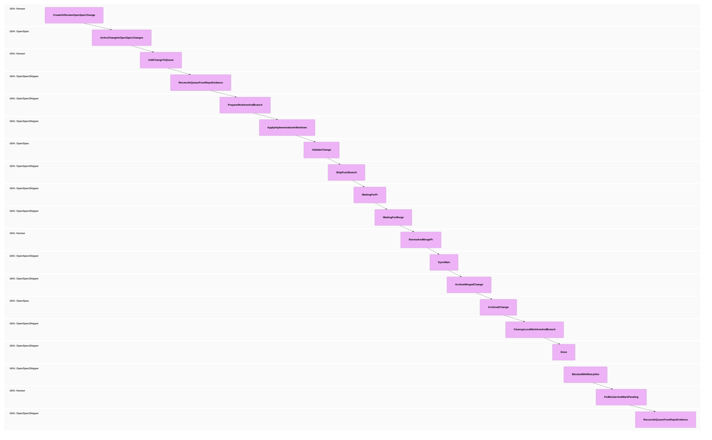

# openspec-shipper

`openspec-shipper` is a small CLI that runs an OpenSpec delivery queue through
AI executors. The v1 provider is OpenCode; Codex CLI support is included as an
experimental provider so the architecture can grow without changing the queue
contract.

The package is npm-first and repo-local by default:

```bash
npm install -D openspec-shipper
npx openspec-shipper init
npx openspec-shipper doctor
```

There is no `postinstall` mutation. `init` is the command that installs project
assets, and it writes state only under `.openspec-shipper/` plus provider assets
such as `.opencode/`.

## Requirements

- `git`
- `gh`, authenticated with GitHub CLI
- OpenCode for the stable v1 provider
- The package manager configured during `init`

`gh` is used by the runner to reconcile PR state before spending tokens. That is
how `waiting_for_pr` becomes `waiting_for_merge`, and how `waiting_for_merge`
becomes `sync` after a PR has been merged.

Before running the queue, `main` should be clean except for ignored shipper
runtime state such as `.openspec-shipper/queue.md`, logs, lock files, and
`worktrees/`. `doctor` fails when it sees non-runtime changes because the native
`prepare` phase creates feature worktrees from the main checkout.

## Commands

```bash
openspec-shipper init
openspec-shipper doctor
openspec-shipper update

openspec-shipper queue add <change-name>
openspec-shipper queue next
openspec-shipper queue run
openspec-shipper queue status
openspec-shipper queue dry-run
openspec-shipper queue stop
openspec-shipper queue stats
```

Top-level aliases are also available:

```bash
openspec-shipper add <change-name>
openspec-shipper next
openspec-shipper run
openspec-shipper status
openspec-shipper dry-run
openspec-shipper stop
openspec-shipper stats
```

The old Bun scripts are kept as transition helpers in this repository, but new
docs should use the CLI above.

## State And Env

Runtime state lives in the target repository:

```text
.openspec-shipper/
  config.json
  .env
  .env.example
  queue.md
  runs/
  tmp/
  installed.json
  shipper.lock
  stop
```

`openspec-shipper` never loads the target app's `.env`. It only reads
`.openspec-shipper/.env`, or the file passed with `--env-file`.

Config precedence is:

```text
CLI flags > process.env OPENSPEC_SHIPPER_* > .openspec-shipper/.env > .openspec-shipper/config.json > defaults
```

Useful variables:

```bash
OPENSPEC_SHIPPER_PROJECT_DIR=/absolute/path/to/repo
OPENSPEC_SHIPPER_QUEUE_PATH=/absolute/path/to/repo/.openspec-shipper/queue.md
OPENSPEC_SHIPPER_PROVIDER=opencode
OPENSPEC_SHIPPER_OPENCODE_BIN=opencode
OPENSPEC_SHIPPER_OPENCODE_MODEL=opencode-go/deepseek-v4-pro
OPENSPEC_SHIPPER_CODEX_BIN=codex
OPENSPEC_SHIPPER_CODEX_MODEL=gpt-5.4
OPENSPEC_SHIPPER_PRINT_LOGS=1
OPENSPEC_SHIPPER_LOG_LEVEL=ERROR
OPENSPEC_SHIPPER_STATS=1
```

`init` adds these ignored entries:

```gitignore
# OpenSpec Shipper local state
.openspec-shipper/.env
.openspec-shipper/queue.md
.openspec-shipper/shipper.lock
.openspec-shipper/stop
.openspec-shipper/runs/
.openspec-shipper/tmp/
worktrees/
```

## Init

Interactive mode:

```bash
npx openspec-shipper init
```

Non-interactive mode:

```bash
npx openspec-shipper init --yes --provider opencode --package-manager npm
```

Current implementation still uses the previous profile flag while the
interactive wizard is being expanded:

```bash
npx openspec-shipper init --profile node-npm
```

`init` installs:

- `.openspec-shipper/config.json` and `.openspec-shipper/.env.example`
- `.openspec-shipper/README.md` and `.openspec-shipper/queue.example.md`
- `.openspec-shipper/openspec-config.example.yaml` as optional OpenSpec config guidance
- `.openspec-shipper/scripts/` with shipper-owned validation helpers
- `.opencode/commands`, `.opencode/agents`, `.opencode/rules`
- GitHub workflow for auto PR creation after branch push
- package scripts and missing dev dependencies
- `.gitignore` entries for shipper state and worktrees

The installer does not overwrite the target repo's root `README.md`; that file
belongs to the application. A repo-local usage guide is installed at
`.openspec-shipper/README.md`.

Commit the installed project assets on `main` before running the queue. The
native `prepare` phase creates feature worktrees from `HEAD`; if `main` is dirty after
`init`, the new worktree would miss the freshly installed scripts, workflows,
provider commands, and package changes. Local queue state remains ignored.

```bash
git status --short
git add <installed files you want to track>
git commit -m "chore: install openspec shipper"
```

`update` refreshes installed assets using `.openspec-shipper/installed.json`.
Locally changed files are reported as `drifted` instead of overwritten; use
`--force` only when replacing local edits intentionally.

## Queue

`queue add` creates the queue if needed and avoids duplicates:

```bash
npx openspec-shipper queue add add-name-greeting
npx openspec-shipper queue add openspec/changes/add-spanish-greeting
npx openspec-shipper queue add add-shouting-greeting --depends-on add-spanish-greeting
```

Queue format:

```md
- [ ] deliver add-name-greeting
- [ ] deliver add-spanish-greeting <!-- depends_on: add-name-greeting -->
- [ ] sync
```

`deliver` advances through:

```text
prepare -> apply -> ship -> waiting_for_pr -> waiting_for_merge -> sync -> archive -> cleanup
```



`prepare` is native runner logic: it creates or reconnects
`worktrees/<change-name>` and the deterministic implementation branch before
any AI executor is called. `apply` then spends model tokens only on
implementation inside that prepared workspace.

`waiting_for_merge` is intentionally not runnable. The runner uses `gh` to
notice when the PR has merged and then reconciles the task to `phase: sync`, so
the shipper can sync `main`, archive safely, and clean local artifacts.

### Reverse State Inference

`queue.md` is the human-facing source of truth, but it is reconciled before each
queue command. Reconciliation infers the most advanced observable state first,
instead of trusting the phase comment blindly:

```text
archived and locally clean -> done
archived but local work remains -> cleanup
merged PR -> sync
open PR -> waiting_for_merge
remote branch -> waiting_for_pr
local work complete -> ship
local work incomplete -> apply
active change without local work -> prepare
nothing found -> blocked
```

This backwards inference avoids false blockers when an earlier phase can no
longer see its original inputs because a later phase already happened. For
example, after `openspec archive` succeeds, `openspec/changes/<change-name>/`
disappears. The reconciler therefore checks `openspec/changes/archive/` before
concluding that an archive task is broken.

Explicit waiting phases are not regressed just because a transient external
check returns no data. For example, `waiting_for_merge` remains waiting unless
the runner positively observes a merged PR, archived change, or completed
cleanup.

When a task blocks, the queue includes a human retry hint below it:

```md
- [!] deliver add-name-greeting <!-- phase: archive; reason: ... -->
  > Fixed? Change `[!]` to `[ ]` and run `openspec-shipper queue run` again.
```

After fixing the cause, change only `[!]` to `[ ]`. The next queue command will
remove the hint, reconcile the task from repository evidence, and retry or move
it to the correct phase.

The `archive` phase is OpenSpec-native: it validates, runs
`openspec archive <change-name> -y`, commits, and pushes the archive/spec diff on
`main`. The `cleanup` phase is OpenSpec Shipper housekeeping: it removes a clean
local `worktrees/<change-name>` worktree and deletes the merged local branch with
`git branch -d` when safe. If there is nothing left to clean, cleanup succeeds as
a no-op.

## Providers

### OpenCode

OpenCode is the stable v1 provider. It builds the same commands as the original
runner:

```bash
opencode run --command openspec-apply-worktree <change>
opencode run --command openspec-ship-worktree <change>
opencode run --command openspec-main-sync
opencode run --command openspec-archive-merged <change>
opencode run --command openspec-cleanup-worktree <change>
```

With config enabled, it also adds:

```bash
--print-logs --log-level ERROR --model <model>
```

### Codex CLI

Codex CLI is experimental. It does not install `.opencode` assets and currently
exists so the provider contract can be tested in the demo flow:

```json
{
  "executor": {
    "provider": "codex-cli",
    "codex": {
      "bin": "codex",
      "model": "gpt-5.4"
    }
  }
}
```

Dry-run will produce command specs like:

```bash
codex exec -C <projectDir> --sandbox workspace-write --ask-for-approval never --model <model> <prompt>
```

Claude Code is intentionally roadmap-only for now.

## Local And External Modes

Default local mode runs inside the target repo:

```bash
cd /path/to/target-repo
npx openspec-shipper queue dry-run
npx openspec-shipper queue run
```

External mode is still supported:

```bash
npx openspec-shipper \
  --project /path/to/target-repo \
  --queue /path/to/target-repo/.openspec-shipper/queue.md \
  queue dry-run
```

This keeps the hybrid option open while making the npm-installed local workflow
the normal path.

## Demo

The demo repo is at:

```text
/Users/javigomez/Documents/projects/openspec-demo
```

Suggested walkthrough for a GIF:

```bash
git clone <demo-url> openspec-demo-gif
cd openspec-demo-gif
npm install
npm install -D openspec-shipper
npx openspec-shipper init --profile node-npm
npx openspec-shipper doctor
npx openspec-shipper queue add add-name-greeting
npx openspec-shipper queue add add-spanish-greeting --depends-on add-name-greeting
npx openspec-shipper queue add add-shouting-greeting --depends-on add-spanish-greeting
npx openspec-shipper queue status
npx openspec-shipper queue dry-run
npx openspec-shipper queue run
```

For local tarball testing before publish:

```bash
npm run build
npm pack
cd /Users/javigomez/Documents/projects/openspec-demo
npm install -D /path/to/openspec-shipper-0.1.0.tgz
npx openspec-shipper doctor
npx openspec-shipper queue dry-run
```

## Publishing Checklist

Run these before publishing:

```bash
bun test
npm run build
npm_config_cache=/private/tmp/openspec-shipper-npm-cache npm pack --dry-run
```

Then test the generated tarball in `openspec-demo`. Publish only after the
manual OpenCode demo works:

```bash
npm publish --access public
```
