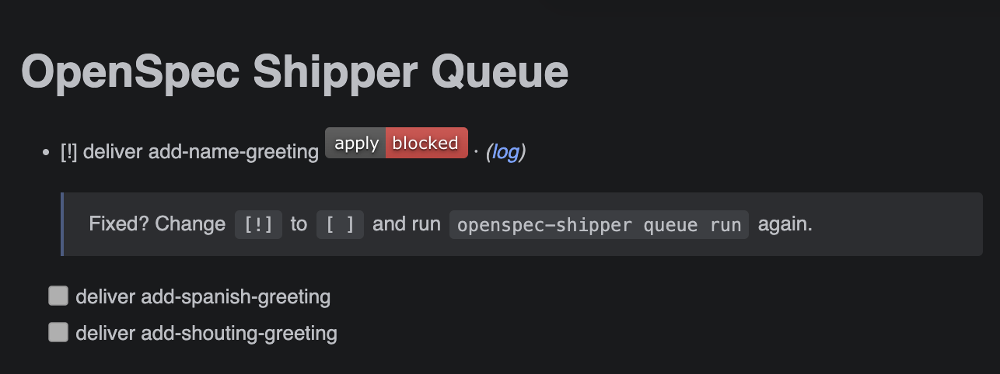

# When the Queue Blocks

Goal of this page: lose the fear of `[!]`. A blocked task is not a failure — it's Shipper handing control back to you instead of guessing or burning tokens.

## What it looks like



```md
- [!] deliver add-name-greeting <!-- phase: push; reason: ...; log: runs/... -->
  > Fixed? Change `[!]` to `[ ]` and run `openspec-shipper queue run` again.
```

## The simple case (most blocks)

Many blocks need nothing more than flipping one character. A PR waiting for your merge, a transient network hiccup, a check that failed once — you resolve the cause (or it resolves itself), then:

1. Change `[!]` back to `[ ]` in `queue.md`.
2. Run `npx openspec-shipper queue run`.

That's the whole recovery. Shipper re-examines Git and GitHub evidence before retrying, so it resumes from the right phase automatically — you never need to figure out where it was.

## The harder case

When the fix isn't obvious:

1. Read the `reason` in the task's metadata comment — Shipper writes down why it stopped.
2. Follow the `log` link next to it for the full execution output.
3. Fix it yourself — or paste the reason and the log into your AI assistant and let it diagnose and solve the issue. The logs are written to be machine-readable for exactly this.
4. Flip `[!]` to `[ ]` and run the queue again.

## Common causes worth knowing

- A pull request is simply waiting for you to merge it (expected, not an error).
- `gh` lost authentication or lacks access to the repo.
- The installed Shipper assets were never committed and pushed to the base branch.
- The repository checks fail inside the implementation worktree.
- The executor CLI is missing, logged out, or misconfigured — `npx openspec-shipper doctor` catches these.

## What's next

Now that running the queue holds no surprises, make it cheaper: [Pick the right model for each job](./choosing-models.md).
