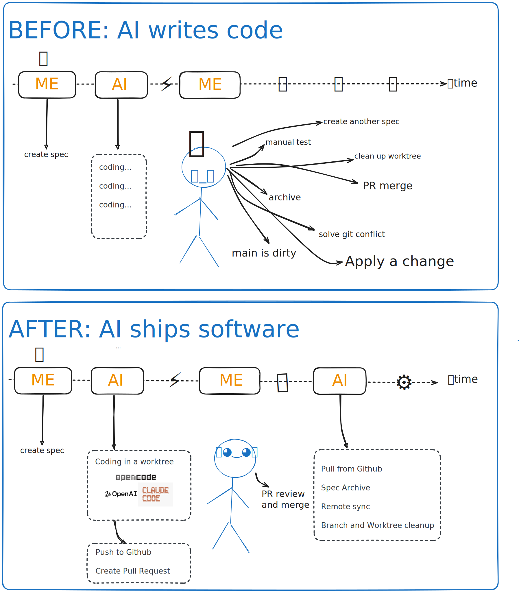

# Ship Like a Team of Two

Goal of this page: adopt the few habits that turn Shipper from "a tool I run" into "a teammate who codes while I think".

## From multitasking to focus

Running OpenSpec by hand, parallel work means *you* juggling: switch branch, implement, run checks, push, open PR, switch back, remember where you were. Every switch costs focus.

With Shipper the parallelism moves out of your head and into worktrees. You hold two roles only:

- **Author** — write the next OpenSpec change.
- **Reviewer** — read PRs, request fixes, merge.

Everything between those two — worktrees, implementation, branch refresh, pushes, PRs, archiving, cleanup — runs in the background, one queue item after another. The queue is your team's task board, and it's just a Markdown file.

## Treat Shipper as a teammate

Shipper behaves like a colleague pushing code to your repo, and the same etiquette applies — in both directions:

**Pull often.** While the queue runs, merged PRs keep landing on `main`. Your checkout falls behind just like it would with a productive teammate. Make `git pull` a reflex — especially before writing a new spec, so you plan against the code that actually exists, not last morning's version.

**Review like you mean it.** The PR is your quality gate. Shipper guarantees process (checks ran, branch is fresh, spec was followed); *you* guarantee judgment. A two-minute review of a well-specified small change is normal — that's the spec doing its job.

**Communicate through the artifacts.** Want different behavior? Improve the spec, not the prompt. Blocked task? The reason is written on the task. Wondering what it's doing? `queue status`. Everything Shipper knows is in files you can read.

## A day in the loop

1. `git pull` — catch up with what your teammate merged overnight.
2. Write or refine a change spec; commit it; `queue add`.
3. `queue run` (or leave it running) and go back to planning.
4. PR notification arrives → review → merge.
5. Repeat. At the end of the day, `queue stats` tells you what your teammate's work cost.

That's the whole method. You think, Shipper ships.
