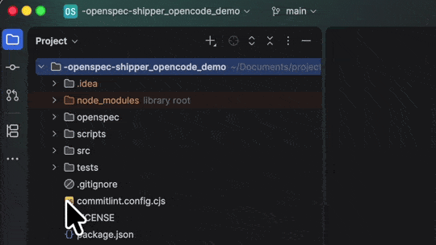

# OpenSpec Shipper

You write OpenSpec changes. Shipper implements them with an AI agent, opens the pull request, and archives the spec once you merge. Your job shifts from multitasking between branches to two things only: **writing specs** and **reviewing PRs**.

This documentation is organized as a learning path. Follow it in order the first time; each step builds on the previous one.

## The path

1. **[Quick start](./guide/quick-start.md)** — install Shipper in your repo and ship your first change.
2. **[Master the queue](./guide/queue.md)** — the queue is a Markdown file you own; learn to add, order, and control work.
3. **[Plan changes while Shipper ships](./guide/plan-changes.md)** — write new OpenSpec changes on main, a branch, or a worktree, and feed them to the queue.
4. **[When the queue blocks](./guide/blocked-queue.md)** — blocks are normal and expected; most fixes are one character.
5. **[Pick the right model for each job](./guide/choosing-models.md)** — plan with powerful models, implement with cheaper ones.
6. **[Ship like a team of two](./guide/ship-like-a-team.md)** — work habits that make you and Shipper a productive pair.

Want to see it working before installing anything? Clone the **[one-minute demo repo](https://github.com/javigomez/clean-repo-for-openspec-shipper-demo)** and follow its README.

## Reference

When you need exact details: [Delivery flow](./reference/delivery-flow.md), [Providers](./providers/index.md), [CLI](./reference/cli.md), and [Configuration](./reference/configuration.md).
